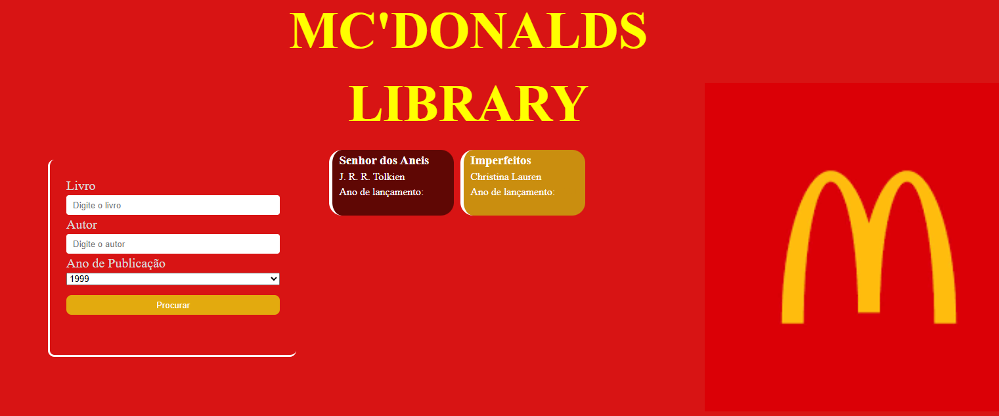

 # 🟡 Biblioteca

O objetivo do projeto é permitir que o usuário informe o nome do livro e o nome do autor. Em seguida, deverá ser adicionado o ano de publicação da obra. Os livros publicados antes do ano 2000 serão exibidos na cor vermelho-vinho, representando livros clássicos, enquanto os publicados a partir de 2000 serão exibidos da cor amarela representando livros modernos.

---
## 🟡 Funcionalidades

- Adiciona card com cores relacionada ao ano de lançamento
- Validação de campos

---
## 🟡 Tecnologias Utilizadas

- HTML5
- CSS3
- JavaScript (ES6+)
- VS Code
- Git e GitHub

---
## 🟡 Como rodar o projeto​?

1 Baixe o repositório (Clique no Botão “Code” > Download ZIP)​

2 Extraia a pasta​

3 Abra o arquivo index.html no navegador​

## Acesse o projeto online
  https://luiscamara123.github.io/Senac/Front-end/Biblioteca/

---
## 🟡 Como clonar o projeto​

**No terminal do VS Code digite:​**
  git clone https://github.com/Luiscamara123/Senac.git

No GitHub Desktop:​
  No menu: File(Arquivo) > Clone a repositor(Clonar repositório) > Selecione a aba URL, no campo URL, cole o link do repositório 

https://github.com/Luiscamara123/Senac.git

---
## 🟡 Melhorias futuras

- Organização na estrutura de códigos
- Funções com a Linguagem JavaScrpit
- Banco de Dados
- Layout responsivo

---
## 🟡 O que eu aprendi?

- layout com CSS
- Estrutura e validação de códigos com JavaScript

---
## 🟡 Autor

**Luís Felipe Câmara Alcântara**
