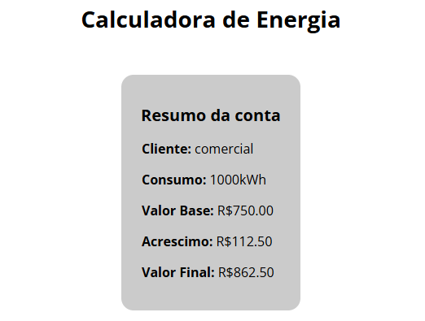

# ⚪ Calculadora Energia

O objetivo do projeto é informar o consumo diário de energia elétrica e identificar o tipo de cliente, que pode ser comercial, residencial ou industrial. Após essa etapa, será apresentado o cálculo do consumo, contendo o tipo de cliente, o consumo registrado, o valor base, o acréscimo aplicado e o valor final a ser pago.

---
## ⚪ Funcionalidades

- Calcula o seu consumo de energia conforme seu tipo de cliente
- Validação de campos
- Layout responsivo

---
## ⚪ Tecnologias Utilizadas

- HTML5
- CSS3
- JavaScript (ES6+)
- VS Code
- Git e GitHub

---
## ⚪ Como rodar o projeto​?

1 Baixe o repositório (Clique no Botão “Code” > Download ZIP)​

2 Extraia a pasta​

3 Abra o arquivo index.html no navegador​

## Acesse o projeto online
  https://luiscamara123.github.io/Senac/Front-end/Calculadora-Energia/

---
## ⚪ Como clonar o projeto​

**No terminal do VS Code digite:​**
  git clone https://github.com/Luiscamara123/Senac.git

No GitHub Desktop:​
  No menu: File(Arquivo) > Clone a repositor(Clonar repositório) > Selecione a aba URL, no campo URL, cole o link do repositório 

https://github.com/Luiscamara123/Senac.git

---
## ⚪ Melhorias futuras

- Organização na estrutura de códigos
- Funções com a Linguagem JavaScrpit
- Aplicação de bancos de Dados

---
## ⚪ O que eu aprendi?

- Responsividade e layout com CSS
- Estrutura e validação de códigos com JavaScript

---
## ⚪ Autor

**Luís Felipe Câmara Alcântara**

Turma de Tecnologia em Informática para internet (Vespertino) - Senac DF

