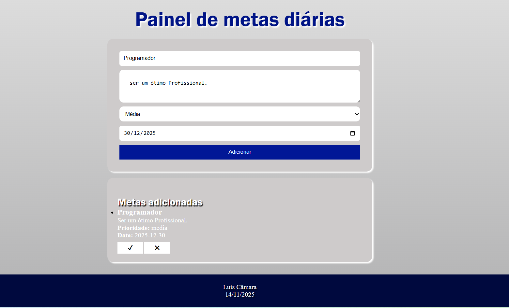

# ⚪ Projeto - Formulário metas

O Objetivo do projeto é adicionar uma meta com uma descrição e determinar a sua prioridade sendo elas (baixa, alta e média), com um input do type "Date" para adicionar um prazo de realização da meta prevista, após o preenchimento do formulário aparecera um campo que vai imprimir as informações listadas anteriormente, e com o surgimento de 3 botões (confirmar, voltar e cancelar) para suas funções designadas.

---
## ⚪ Funcionalidades

- Adiciona Metas
- Remove Metas
- Marcar como concluída
- Validação de campos
- Layout responsivo

---
## ⚪ Tecnologias Utilizadas

- HTML5
- CSS3
- JavaScript (ES6+)
- VS Code
- Git e GitHub

---
## ⚪ Como rodar o projeto​?

1 Baixe o repositório (Clique no Botão “Code” > Download ZIP)​
2 Extraia a pasta​
3 Abra o arquivo index.html no navegador​

## Acesse o projeto online
  https://luiscamara123.github.io/Senac/Front-end/Formul%C3%A1rio-metas/

---
## ⚪ Como clonar o projeto​

**No terminal do VS Code digite:​**
  git clone https://github.com/Luiscamara123/Senac.git

No GitHub Desktop:​
  No menu: File(Arquivo) > Clone a repositor(Clonar repositório) > Selecione a aba URL, no campo URL, cole o link do repositório 

https://github.com/Luiscamara123/Senac.git

---
## ⚪ Melhorias futuras

- implementar banco de dados
- Organização na estrutura de códigos
- Funções com a Linguagem JavaScrpit

---
## ⚪ O que eu aprendi?

- Responsividade com CSS
- Estrutura e validação de códigos com JavaScript

---
## ⚪ Autor

**Luís Felipe Câmara Alcântara**

Turma de Tecnologia em Informática para internet (Vespertino) - Senac DF
