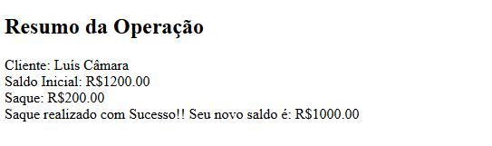

# ⚫ Projeto Saque

O objetivo do projeto é calcular o valor de saque realizado pelo usuário. Inicialmente, o sistema solicita o nome do cliente e o saldo inicial da conta. Em seguida, é solicitado o valor que o cliente deseja sacar.

Ao final do processo, caso o valor solicitado esteja dentro do limite do saldo disponível, será exibida uma mensagem informando que o saque foi realizado com sucesso, juntamente com o novo saldo da conta.

Caso o valor do saque solicitado seja superior ao saldo disponível, o sistema exibirá uma mensagem informando que o saldo é insuficiente e apresentará o saldo inicial do cliente.

---
## ⚫ Funcionalidades

- Calcula o saque realizado
- Validação de campos
- Layout responsivo

---
## ⚫ Tecnologias Utilizadas

- HTML5
- JavaScript (ES6+)
- VS Code
- Git e GitHub

---
## ⚫ Como rodar o projeto​?

1 Baixe o repositório (Clique no Botão “Code” > Download ZIP)​

2 Extraia a pasta​

3 Abra o arquivo index.html no navegador​

## Acesse o projeto online
  https://luiscamara123.github.io/Senac/Front-end/Projeto-Saque/

---
## ⚫ Como clonar o projeto​

**No terminal do VS Code digite:​**
  git clone https://github.com/Luiscamara123/Senac.git

No GitHub Desktop:​
  No menu: File(Arquivo) > Clone a repositor(Clonar repositório) > Selecione a aba URL, no campo URL, cole o link do repositório 

https://github.com/Luiscamara123/Senac.git

---
## ⚫ Melhorias futuras

- Organização na estrutura de códigos
- Funções com a Linguagem JavaScrpit
- Aplicação de bancos de Dados
- Estilização CSS

---
## ⚫ O que eu aprendi?

- Estrutura e validação de códigos com JavaScript

---
## ⚫ Autor

**Luís Felipe Câmara Alcântara**

Turma de Tecnologia em Informática para internet (Vespertino) - Senac DF

